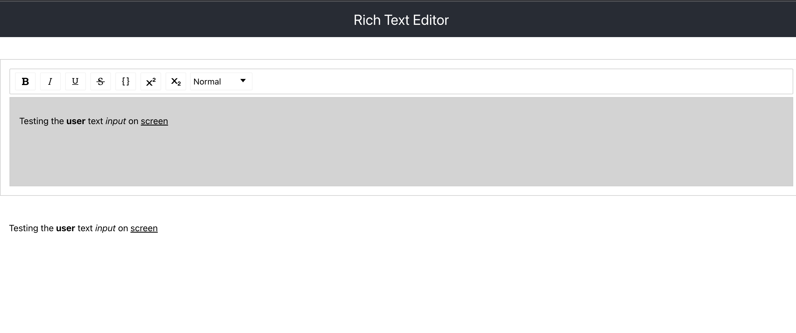

# rich-text-editor

A rich text editor component and a preview section created with [Draft.js](https://github.com/facebook/draft-js)
and [react-draft-wysiwyg](https://github.com/jpuri/react-draft-wysiwyg)

## How to run this project locally

- Clone this [project](https://github.com/obalax/rich-text-editor)

- Run `npm install` or `yarn install`in both folders to install all their dependencies.

- Start the project using `npm start` or `yarn start`

- Check the readme for more information.
